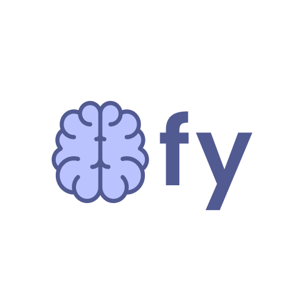
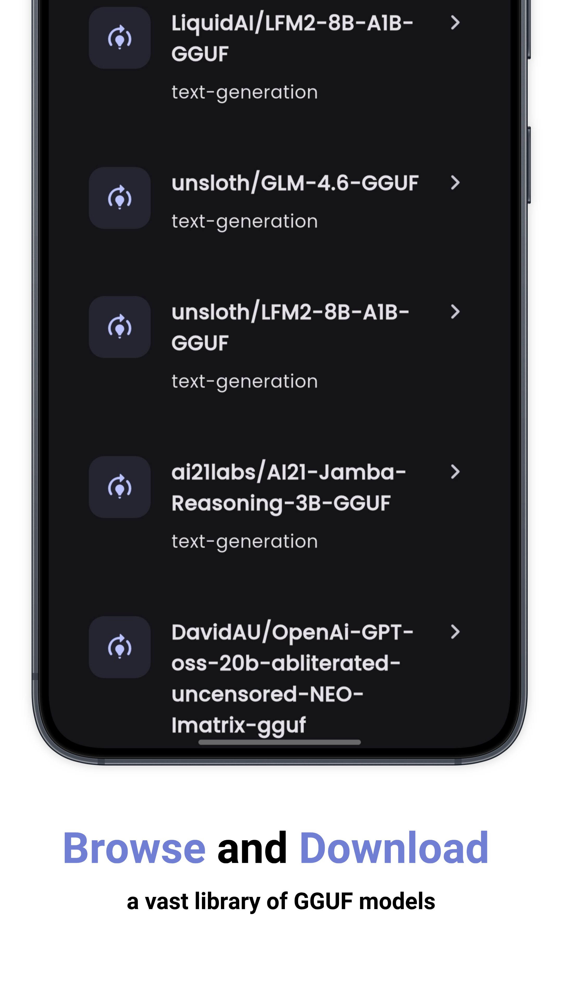
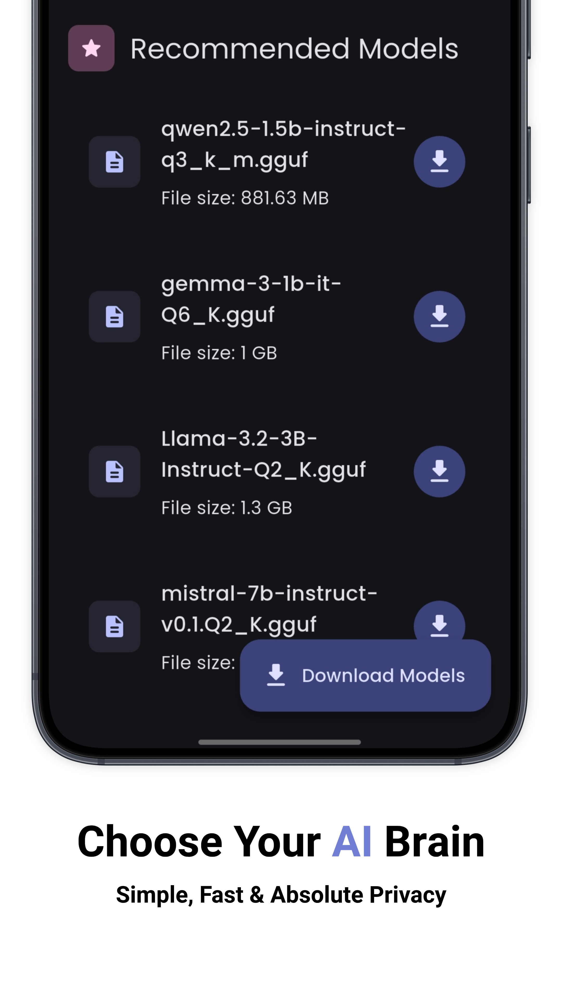
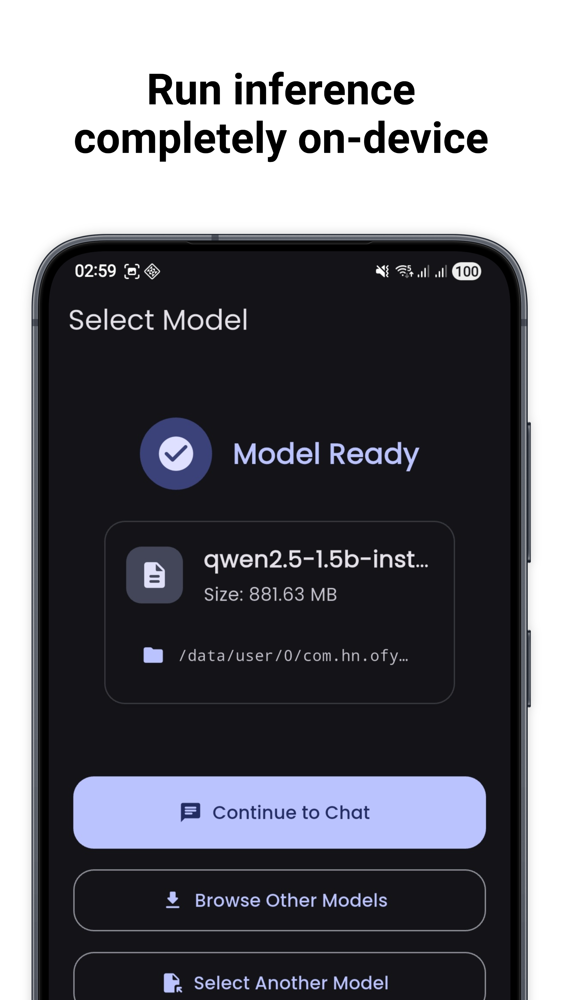

  

# Ofy Chat App

A Flutter-based cross-platform chat application that integrates on-device generative AI for local inference of large language models (in GGUF format) 

  
  
  
  
  

## Features

- Browse and select GGUF model files from your device
- Chat with the selected model locally (offline)
- Real-time token streaming for AI responses
- Clean and intuitive UI with Material 3 design
- BLoC architecture with GetIt dependency injection

## Screenshots

  
  
  
  
  

## Getting Started

1. Clone this repository
2. Run `flutter pub get` to install dependencies
3. Launch the app on your device
4. Select a GGUF model file from your device
5. Start chatting with the AI!

## Requirements

- Flutter SDK ^3.7.2
- A GGUF format model file
- Android device (iOS support coming soon)

## Dependencies

- flutter_bloc: ^9.1.0 (for state management)
- get_it: ^8.0.3 (for dependency injection)
- dartz: ^0.10.1 (for functional error handling)
- equatable: ^2.0.5 (for value comparisons)
- file_picker: ^10.0.0
- path_provider: ^2.1.1
- shared_preferences: ^2.5.3

## Project Architecture

This project follows Clean Architecture principles with BLoC pattern for state management and GetIt for dependency injection. See [ARCHITECTURE.md](ARCHITECTURE.md) for detailed information about the project structure.

### Key Architecture Concepts

- **Clean Architecture**: Separation of concerns with layers (presentation, domain, data)
- **BLoC Pattern**: Business Logic Components for state management
- **Dependency Injection**: Using GetIt as service locator
- **Repository Pattern**: Abstracting data sources
- **Use Cases**: Encapsulating business logic operations

## License

This project is licensed under the MIT License - see the LICENSE file for details.
